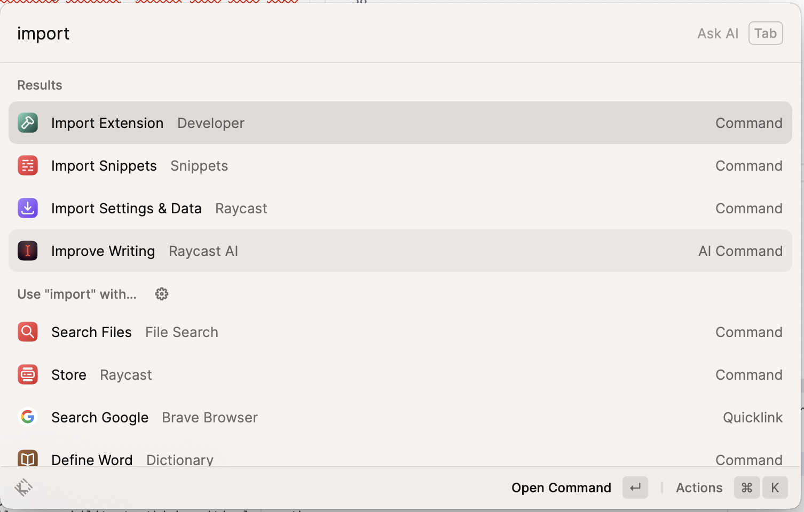

# LLaMa extension for Raycast

A simple extension for Raycast that allows you to interact with [LLaMa.cpp](https://github.com/ggerganov/llama.cpp).

**NOTE**: This is for experimentation purpose only. If you want to work on something similar, please fork this repo.


## Screencast


https://github.com/tuan3w/llama-raycast/assets/2762678/d4170447-477b-474a-bb50-1553f0fc69b9


## Start servers

```bash
cd server
yarn install
yarn server <path_to_ggml_model>
# i.e: yarn server ggml-vic7b-q4_1.bin
```

## Install dependencies & Import extension

Open Raycast launcher and import the extension




## License

[MIT](LICENSE)
